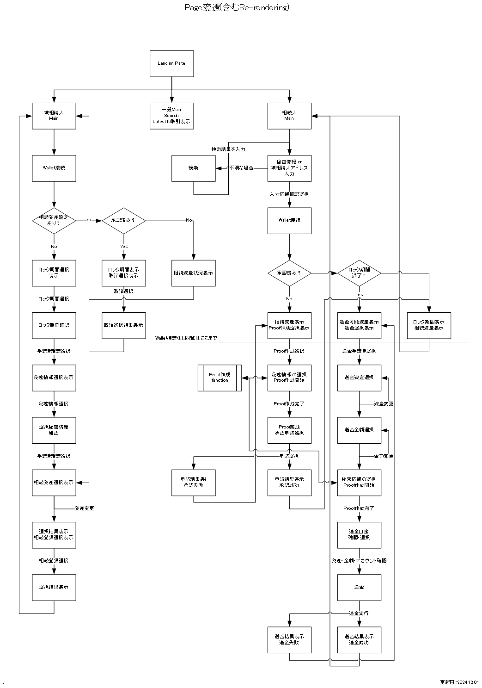

## 全体構成

- **LPページ**
  - アプリケーションの概要と利用開始ボタン。

- **管理用UI**
  - **初期設定ページ**：ハッシュの生成と登録、トークンの承認(保有トークン一覧の表示)、トークンの追加。
  - **状態確認ページ**：相続状況のモニタリング、相続キャンセル機能。

- **相続用UI**
  - **相続開始ページ**：アドレス一覧から選択、ZK証明の提出、相続プロセスの開始。
  - **トークン引き出しページ**：アドレス一覧から選択、ロック期間終了後のトークン引き出し。

- **共通UI**
  - **進行状況トラッカー**：現在の相続プロセスのステータス表示。

