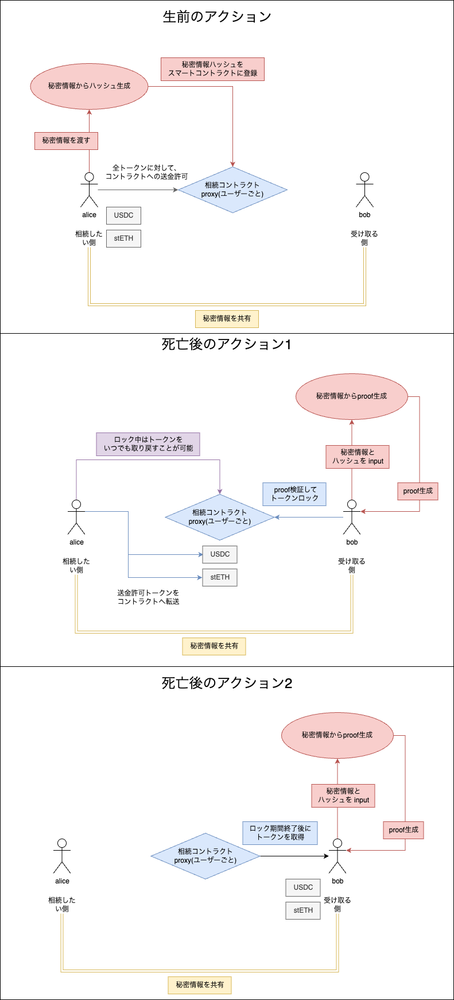

# 相続アプリケーション設計概要

## 登場人物

- **Alice** は **Bob** に自分の資産を相続させたいと考えています。
- **Bob** は **Alice** から彼女の資産を相続することを希望しています。

## 相続先の証明方法

-  ZK 証明を使用する

|                  |                              |
| ------------------ | ----------------------------------------------------- |
| **事前情報の共有** | Alice と Bob は秘密情報を事前に共有する     |
| **検証方法**       | BobがAliceと同じ秘密情報を入力したことをZK 証明（Zero Knowledge Proof）を用いて検証し、正しいパートナーであることの確認を行う |
| **利点**   | 相続先のアドレスを事前に知る必要がない      |

[コントラクトの詳細](contracts.md)

## 1. ZK を使った検証

### 1.1 **パートナー証明の確立**

- **Alice** と **Bob** は事前に秘密情報を共有します。この情報は、相続時に ZK 証明として使用されます。
- **Alice** は自分と Bob のアドレス、そして共有された秘密情報を使ってハッシュを生成し、スマートコントラクトに登録します。このハッシュは公開されますが、Bob のアドレスや秘密情報は秘匿されます。

### 1.2 **トークン転送許可の設定**

- Alice は、トークンの approve 設定をスマートコントラクトに対して行います。

### 1.3 **パートナー確認と死亡後のトークンロック**

- Alice が死亡したと見なされた場合、Bob は相続を開始します。Bob は秘密情報を元に ZK 証明（ZK proof）を生成し、その証明をスマートコントラクトに提出します。
- スマートコントラクトは ZK 証明を検証し、Alice が登録したハッシュと一致することを確認します。これにより Bob が正しい相続者であると証明されます。
- トークンはデフォルトで 3 ヶ月間ロックされ、その期間中は Alice が引き出すことも可能です。

### 1.4 **トークンの引き出し制限と解除**

- ロック期間終了後、Alice が引き出さなかった場合、システムは Alice が死亡したとみなします。
- ロック解除後、Bob はトークンを引き出すことが可能になります。不正な申請が行われた場合は、Alice が引き出すことで防ぐことができます。

