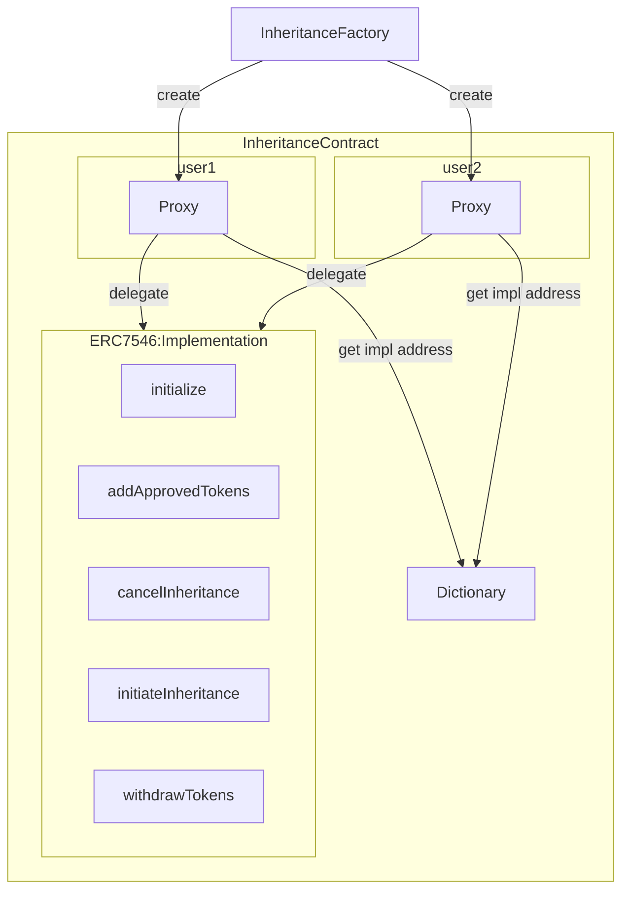

# **InheritanceFactory**

- InheritanceContract の proxy のデプロイと initialize を行うコントラクトです。

### 変数

- `mapping(address => address) public ownerToProxy;` : オーナーアドレス -> プロキシアドレスのマッピング

### 関数

`InheritanceFactory`は、ユーザーごとに `InheritanceContract` のプロキシをデプロイし、そのプロキシを初期化します。

```solidity
function createProxy() external {
    // 各ユーザーのプロキシをデプロイし初期化を行う
}
```

# **InheritanceContract**

- `InheritanceContract`は、各ユーザーの相続相手の検証と、トークンの相続処理を行うコントラクトです。
- `InheritanceContract`は、ERC7546 を使って、構築します。
- 安全性を高めるために 1 ユーザー、1proxy として構築され、他のユーザーと approve 先が競合しないようにします。

### 変数

全ての変数は ERC7201 に準拠します。

- `address owner`: Alice のアドレス
- `address factory`: factoryコントラクト のアドレス
- `bytes32 hash`: 生成したハッシュ
- `bool isLocked`: 相続が進行中かどうかを管理
- `bool isKilled`: 相続がキャンセルされた場合に、コントラクトが無効化されているかどうかを管理
- `uint256 lockDuration`: トークンのロック期間（n ヶ月または n 年）
- `uint256 lockStartTime`: トークンロックが開始された日時
- `uint256 nance`: 署名の再利用防止のための nonce
- `address[] public approvedTokens`: `approve`したトークンを保存する配列
- `mapping(bytes => bool) public usedProofs`: 利用済みの `proof` を記録し、再利用を防ぐためのマッピング

### 共通関数コントラクト（implementation にとして登録するコントラクト）

#### 1. **initialize**

Alice がハッシュ値とロック期間を設定します。プロキシデプロイ時に一度だけ実行可能な関数です。

```solidity
function initialize(bytes32 _hash, uint256 _lockTime) external {
    // 初期化処理
}
```

#### 2. **addApprovedTokens**

`initialize`以外に、新しいトークンを追加できる関数です。

```solidity
function addApprovedTokens(address[] calldata _tokens) external {
    // トークンを追加
}
```

#### 3. **cancelInheritance**

ロック期間中に Alice がトークンを引き出すための関数です。

```solidity
function cancelInheritance() external {
    // 相続キャンセル処理
}
```

## ZK を使った検証

- **Alice が登録するハッシュ値**:

  - bob と事前に共有した`秘密情報`をハッシュ化したもの
  - `register`関数でハッシュを登録します。

- **ZK 回路**:
  - private input は`秘密情報`
  - public input はスマートコントラクトに登録されている`秘密情報のハッシュ値`
  - output は秘密情報とハッシュ値が一致しているかどうかの`bool`

### 関数コントラクト（implementation にとして登録するコントラクト）

#### 1.4. **initiateInheritance**

Bob がスマートコントラクトにトークンをロックして相続プロセスを開始するための関数です。署名による認証も行われます。

```solidity
function initiateInheritance(bytes calldata proof) external {
    // 相続開始
}
```

#### 1.5. **withdrawTokens**

ロック期間終了後、Bob がトークンを引き出すための関数です。

```solidity
function withdrawTokens(
    address[] calldata _tokens,
    uint256[] calldata _amounts,
    bytes calldata proof
) external {
    // トークン引き出し処理
}
```
