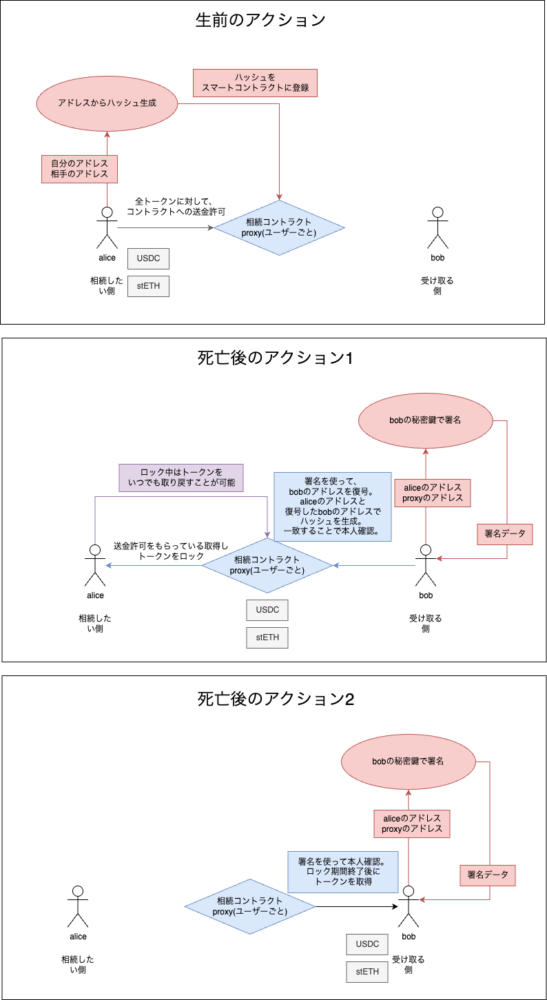

## 2. 署名を使った検証パターン（事前に受け取る側のアドレスがわかっている場合）

### 2.1 **パートナー証明の確立**

- **Alice** は自分のアドレスと Bob のアドレスを使ってハッシュを生成し、スマートコントラクトに登録します。ここで、Bob の情報はまだ確認されておらず秘匿されています。

### 2.2 **トークン転送許可の設定**

- Alice は、トークンの approve 設定をスマートコントラクトに対して行います。

### 2.3 **パートナー確認と死亡後のトークンロック**

- Alice が死亡したと想定される場合、Bob は相続を開始するためにスマートコントラクトに署名を提出します。
- Bob の署名はスマートコントラクトで検証され、そこから Bob のアドレスが抽出され、Alice が登録したハッシュと一致するか確認されます。これにより Bob が正しい相続者であると証明されます。
- トークンはデフォルトで 3 ヶ月間ロックされ、その期間中は Alice が引き出すことも可能です。

### 2.4 **トークンの引き出し制限と解除**

- ロック期間終了後、Alice が引き出さなかった場合、システムは Alice が死亡したとみなします。
- ロック解除後、Bob はトークンを引き出すことが可能になります。不正な申請が行われた場合は、Alice が引き出すことで防ぐことができます。



---

## 署名を使った検証パターン

- **Alice が登録するハッシュ値**:

  - `Aliceアドレス + Bobアドレス + スマートコントラクトアドレス`
  - `register`関数でハッシュを登録します。

- **署名の検証**:
  - 署名は「`Aliceアドレス + Bobアドレス + nonce`」で生成され、リプレイアタックを防ぐために、nonce はスマートコントラクトで管理されます。

### 関数コントラクト（implementation にとして登録するコントラクト）

#### 2.4. **initiateInheritanceSig**

Bob がスマートコントラクトにトークンをロックして相続プロセスを開始するための関数です。署名による認証も行われます。

```solidity
function initiateInheritanceSig(
    address[] calldata _tokens,
    bytes32 signedHash,
    uint8 v,
    bytes32 r,
    bytes32 s
) external {
    // 相続開始
}
```

#### 2.5. **withdrawTokensSig**

ロック期間終了後、Bob がトークンを引き出すための関数です。

```solidity
function withdrawTokensSig(
    address[] calldata _tokens,
    uint256[] calldata _amounts,
    bytes32 signedHash,
    uint8 v,
    bytes32 r,
    bytes32 s
) external {
    // トークン引き出し処理
}
```
